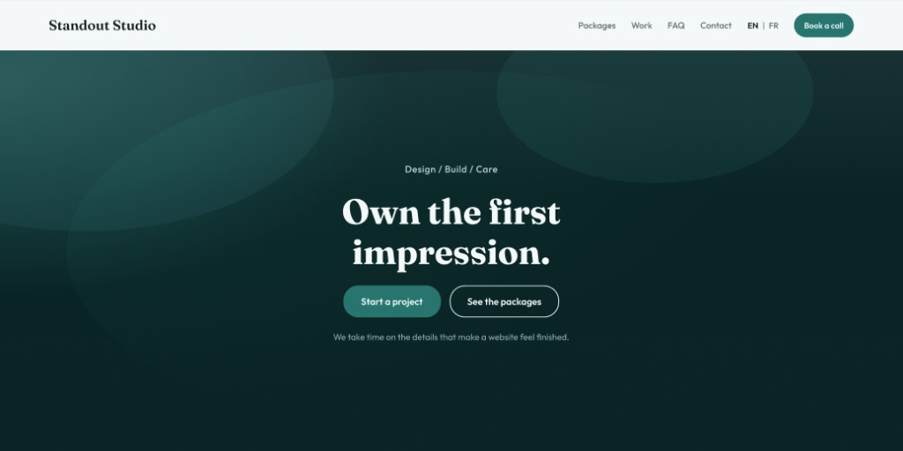

# Standout Studio

<p align="center">
  
</p>

Marketing site for Standout Studio, a bilingual Ottawa web studio.

Live design source: [Figma mockup](https://www.figma.com/design/nLEk8UpVUfFg1SsvmXmjnG)

## Stack

- Next.js (App Router)
- TypeScript
- Tailwind CSS v4

## Getting started

```bash
npm install
npm run dev
```

Open [http://localhost:3000](http://localhost:3000).

## Environment

Copy `.env.example` to `.env.local` and fill in:

| Variable | Purpose |
| --- | --- |
| `NEXT_PUBLIC_SITE_URL` | Canonical site URL |
| `NEXT_PUBLIC_WEB3FORMS_ACCESS_KEY` | Contact form delivery ([Web3Forms](https://web3forms.com), free). Create a key with `standout.studio.ottawa@gmail.com` as the destination. The key is public by design (client-side submit). |

On Vercel, add the same variables in Project Settings → Environment Variables.

## Scripts

| Command        | Purpose              |
| -------------- | -------------------- |
| `npm run dev`  | Local development    |
| `npm run build`| Production build     |
| `npm run start`| Serve production     |
| `npm run lint` | ESLint               |

## Project structure

```
src/
  app/                 Routes and global styles
  components/
    layout/            Header, footer
    sections/          Homepage sections
    ui/                Shared UI primitives
  content/             Copy and site content (EN first)
```

## Design system (initial tokens)

| Token            | Value     |
| ---------------- | --------- |
| Page background  | `#F5F8F9` |
| Hero background  | `#0B3D3D` |
| Brand teal       | `#0F766E` |
| Ink              | `#0F1C1F` |
| Muted ink        | `#5A6B70` |
| Display font     | Fraunces  |
| Body font        | Outfit    |

## Collaboration

See [CONTRIBUTING.md](./CONTRIBUTING.md).

## License

Private project. All rights reserved unless otherwise stated.
